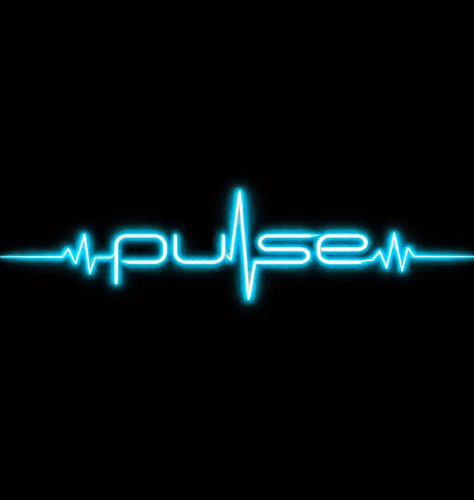
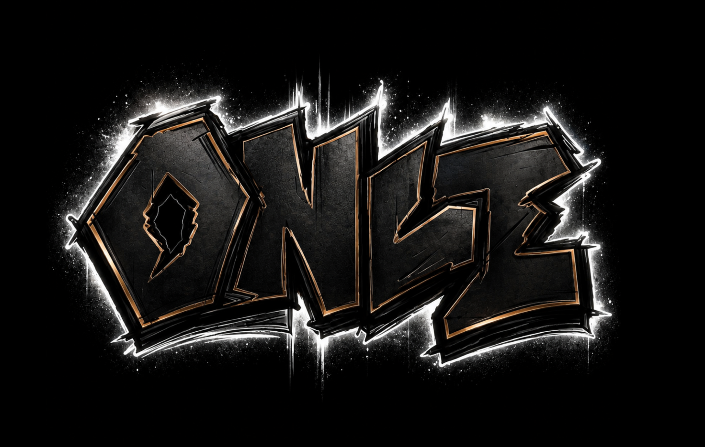

# Hi, I’m Matthew Wainwright

I’m learning web development through CodeX and improving my skills in JavaScript, Git, GitHub, Linux, and the fundamentals of creating software one deliberate step at a time.

I believe the work I create should reflect my character. I want to design with integrity, purposeful precision, curiosity, and respect for the people on the other side of the screen.

I’m not learning to code simply to make things function. I want to create things that matter—software that helps people, strengthens connection, and leaves every project, teammate, and community better than I found them.

## What I’m Building Toward

I want to become the kind of developer who builds with purpose and never settles for convenience when integrity demands more.

I’m building skills that cannot be taken from me, learning to approach challenges with discipline, and working to build better than I did yesterday.

## Current Vision: Pulse

Pulse is a music-centered community concept created to deepen the relationship between people, artists, and the music that matters to them.

The goal is not engagement for engagement’s sake. The goal is meaningful connection.

Pulse is grounded in a simple belief: music can help people step away from the noise of everyday life, reconnect with themselves, and leave more alive than they arrived.

**Honor the artist. Celebrate the art. Turn your noise down and your music up. Find your Pulse.**

## Creative Concept: Once

Once is an urban streetwear and skate-inspired clothing concept shaped around controlled chaos, bold identity, and designs meant to be felt before they are fully understood.

## What I’m Learning

- JavaScript
- Git and GitHub
- Linux
- Web development fundamentals
- Clean development workflows
- Collaboration and communication
- How to approach challenges with purposeful precision

## A Principle I Build By

**Build something worth building.**
