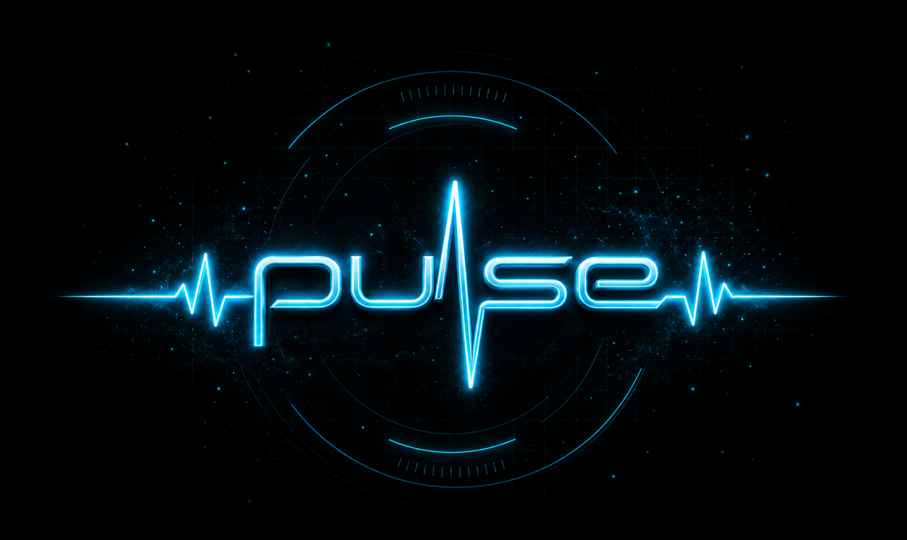
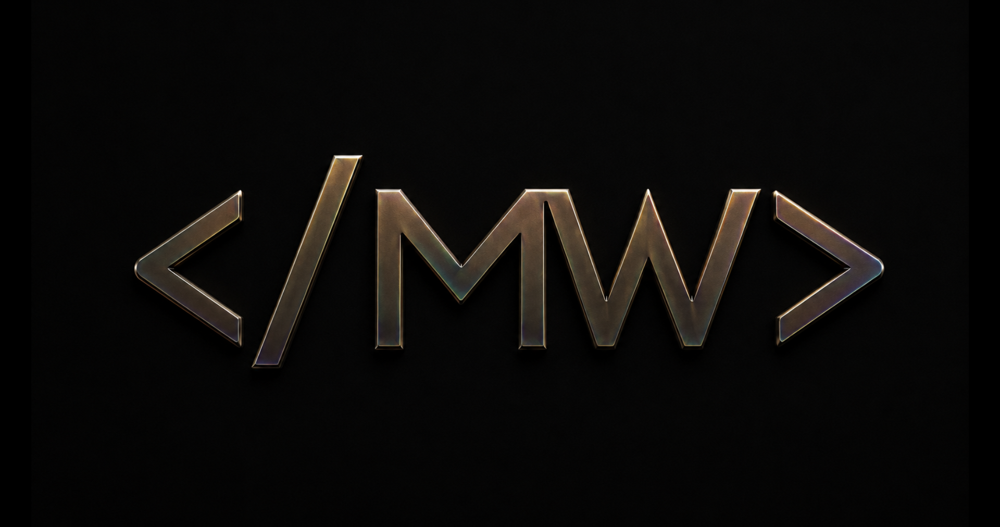

# Matthew Wainwright: A Developer in Training

## What I'm Learning

- HTML
- CSS
- JavaScript
- Git
- GitHub
- Linux
- The fundamentals of creating software

## What I'm Building Toward

I want to become the kind of developer who builds with purpose and never settles for convenience when integrity demands more.

I'm building skills that cannot be taken from me, learning to approach challenges with discipline, and working to build better than I did yesterday.

## Current Vision: Pulse

Pulse is a music-centered community concept created to deepen the relationship between people, artists, and the music that matters to them.

The goal is not engagement for engagement's sake. The goal is meaningful connection.

Pulse is grounded in a simple belief: music can help people step away from the noise, reconnect with themselves, and feel connected to something bigger.

## Creative Concept: Once

Once is a creative concept built around the idea that some moments, opportunities, and experiences only happen once.

## Goals

Learning new techniques to further my skills in Web Development and Software Design so I can produce stronger products that meet the needs of clients and users.

## A Principle I Build By

I believe the work I create should reflect my character. I want to design with integrity, purposeful precision, curiosity, and respect for the people on the other side of the screen.

I'm not learning to code simply to make things function. I want to create things that matter—software that helps people, strengthens connection, and leaves every project, teammate, and community better than I found them.

